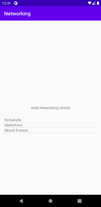
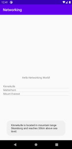

# Förord

Jag vill passa på att påpeka att vissa variabler och dylikt har lite konstiga
namn. Detta beror på att jag inte kunde få kombinationen JSON+GSON att fungera
i min gamla version av Genymotion. Varför kan jag inte svara på, det verkar
helt enkelt inte fungera.
Jag lyckades iaf lösa och testa detta senare på en annan dator och skrev då om
kod parallellt med utkommenterad annan kod. Har därefter städat upp koden
en del men valde att inte döpa om dessa nya variabler, nu när det äntligen fungerade.
Det är därför det t ex finns en array som heter "mountainss".

# Rapport

Jag utgår i min rapport från informationen på duggasidan.

# Add a `ListView` to your layout

En listview lades till i layouten activity_main.xml.
För närvarande har den id "main_list_item_textview".

I MainActivity.java lades följande kod till:

```
public class MainActivity extends AppCompatActivity {
(...)
    private ListView my_list_view;
```

En bit ner under onCreate knyter vi my_list_view till tidigare nämnda layout-id:

```
protected void onCreate(Bundle savedInstanceState) {
(...)
my_list_view = findViewById(R.id.main_list_item_textview);
```

#- Add a `ArrayList<Mountain>` as a member variable in your activity
#- Add a `ArrayAdapter<Mountain>` as a member variable in your activity

Dessa läggs till såhär:

```
public class MainActivity extends AppCompatActivity {
(...)
    private ArrayList<Mountains> mountainArrayList=new ArrayList<>();
    private ArrayAdapter<Mountains> adapter;
```

#- Use `JsonTask` to fetch data from our json web service

Detta görs genom scriptet som vi fick och finns på :
- https://gist.github.com/danieloskarsson/822b6be9dc4b3471910f6dfe1443b892

```
public class MainActivity extends AppCompatActivity {
(...)
    @SuppressLint("StaticFieldLeak")
        private class JsonTask extends AsyncTask<String, String, String> {
    (...)
```

#- Add items to your list of mountains by parsing the json data

Det mesta av koden körs under onPostExecute enligt instruktion men
JSON-datan hämtas redan under onCreate...:

```
        //Get Data from JSON
        new JsonTask().execute("https://wwwlab.iit.his.se/brom/kurser/mobilprog/dbservice/admin/getdataasjson.php?type=brom");
```

"Parsingen" av datan i onPostExecute sker såhär:

```
public class MainActivity extends AppCompatActivity {
(...)
    @SuppressLint("StaticFieldLeak")
        private class JsonTask extends AsyncTask<String, String, String> {
    (...)
        @Override

        //här gör vi vår parsing
        protected void onPostExecute(String json) {
            Log.d("TAG", json);
            Gson gson = new Gson();
            Mountains[] mountainss;
            mountainss = gson.fromJson(json,Mountains[].class);
            mountainArrayList.clear();
            for (int i = 0; i < mountainss.length; i++) {
                mountainArrayList.add(mountainss[i]);
                Log.d("Async ==>", "Added: " + mountainss[i]);
            }
            adapter.notifyDataSetChanged();
        }
```

Det är det som står efter //här gör vi vår parsing som är intressant.
Vi skapar en ny gson-instans.
    (GSON har lästs in via "Project Structure" i File-menyn. Där under "Dependencies".)
Sen placerar vi jsondatan i vår "mountainArrayList".
    Innan vi placerar den där via en for-loop tömmer vi den via:
    mountainArrayList.clear();
När datan förts in i arrayen notifierar vi vår adapter att datan uppdaterats via:
    adapter.notifyDataSetChanged();

    Mountains[]-klassen som referereras bestämmer hur datan läses in.
    den är i stort utformad enligt hur det föreslogs på föreläsningen,
    så kommenterar den inte mer här, men det tar oss till följande punkt:

#- Display the names of the mountains in the `ListView`

Sammankopplingen av adaptern, jsondatan i "mountainArrayList" och listview görs såhär:
```
public class MainActivity extends AppCompatActivity {
    (...)
    @Override
    protected void onCreate(Bundle savedInstanceState) {
    (...)
        adapter=new ArrayAdapter<Mountains>(MainActivity.this,R.layout.list_item_textview,mountainArrayList);
        my_list_view.setAdapter(adapter);
```

#- When tapping a Mountain name one of three things should happen
#- Display Mountain name and 2 other properties as a Toast View

Jag valde Toast View eftersom det kändes tillräckligt.
Det löstes via att en setOnItemClickListener placerades på "mountainArrayList" under onCreate:

```
public class MainActivity extends AppCompatActivity {
    (...)
    @Override
    protected void onCreate(Bundle savedInstanceState) {
    (...)
        //Add an item click listener
        my_list_view.setOnItemClickListener(new AdapterView.OnItemClickListener() {
            @Override
            public void onItemClick(AdapterView<?> parent, View view, int position, long id) {
                Toast.makeText(getApplicationContext(), mountainArrayList.get(position).info(), Toast.LENGTH_SHORT).show();
            }
        });
```

Den textsträng som visas när man klickar på ett berg (refereras till som info() i koden ovan) i listan
är den som bakas ihop i Mountains.java-klassen-såhär:

```
    public String info()
    {
        String tmp=new String();
        tmp+=name+" is located in mountain tange "+location+" and reaches "+meters+"m above sea level.";
        return tmp;
    }
```

Jag märkte nu när jag såg koden igen att jag felstavat 'range' (stavat det 'tange').
Men eftersom jag tog mina screen shots med denna felskrivning låter jag den vara kvar.
(Jag kan inte rätta till detta och ta nya screenshots då denna app inte fungerar på min
dator i min gamla emulator).

#Screenshots


